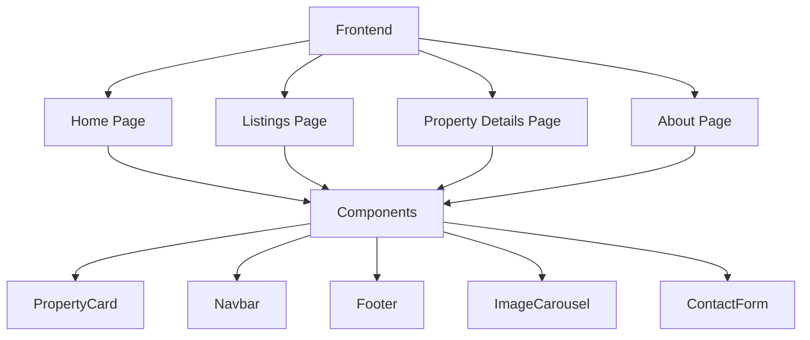
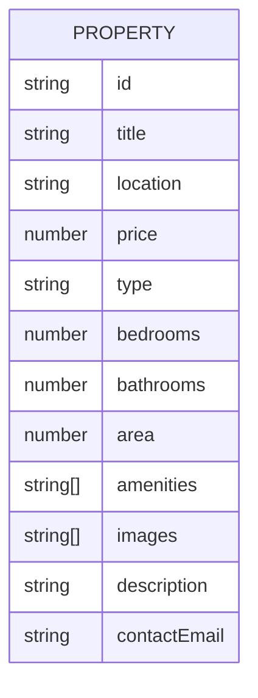

## 1. Architecture Design

## 2. Technology Description
- Frontend: React@18 + TypeScript + Tailwind CSS@3 + Vite
- State Management: Zustand
- Icons: Lucide React
- Routing: React Router DOM
- Initialization Tool: vite-init
- Backend: None (static site with mock data)
- Database: None (mock data in frontend)

## 3. Route Definitions
| Route | Purpose |
|-------|---------|
| / | Home page with hero and featured listings |
| /listings | All property listings with filters |
| /listings/:id | Property details page |
| /about | About Prishna Properties Management |

## 4. API Definitions
No backend - all data is mock data defined in the frontend.

## 5. Server Architecture Diagram
Not applicable - no backend.

## 6. Data Model

### 6.1 Data Model Definition

### 6.2 Data Definition Language
Not applicable - no database.
