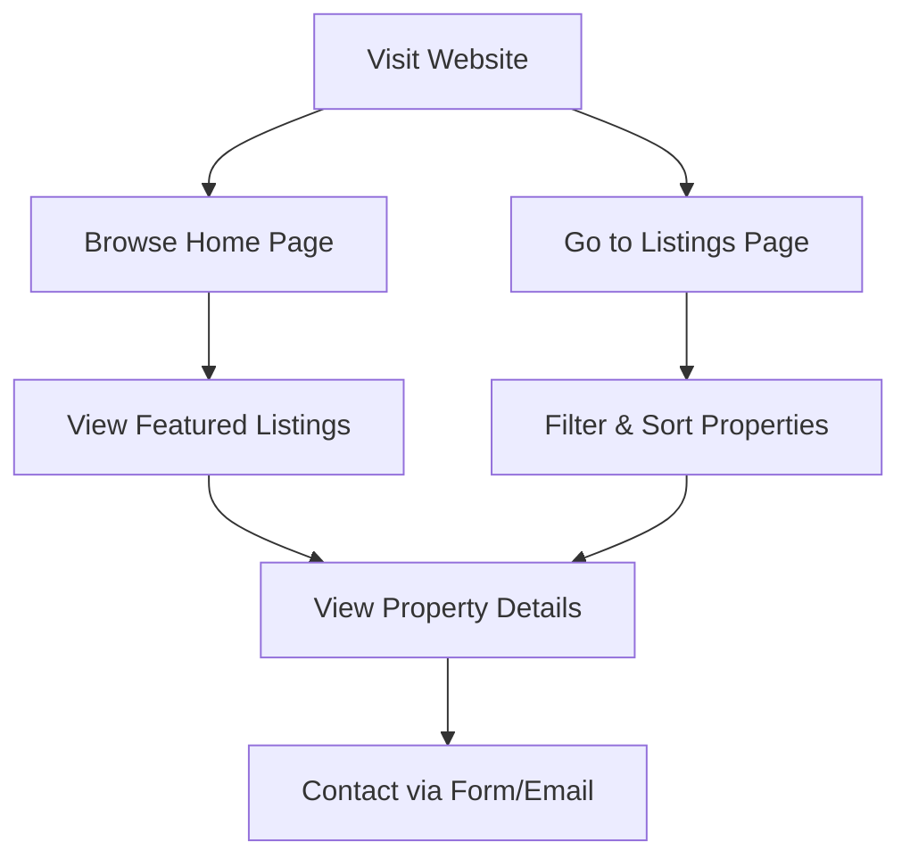

## 1. Product Overview

Prishna Properties Management is a modern housing listing website that showcases available properties for rent and sale, targeting individuals and families looking for residential spaces.

- The website aims to provide a clean, user-friendly interface for property seekers to browse listings, view details, and contact the property management team.
- The design is inspired by housing.com, focusing on professionalism, trust, and visual appeal.

## 2. Core Features

### 2.1 User Roles
| Role | Registration Method | Core Permissions |
|------|---------------------|------------------|
| Guest User | No registration required | Browse listings, view details, contact via email |

### 2.2 Feature Module
1. **Home page**: Hero section with property search, featured listings, navigation
2. **Listings page**: Property grid with filters and sorting
3. **Property details page**: Detailed property information, photos, amenities, contact form
4. **About page**: Company information, mission, contact details

### 2.3 Page Details
| Page Name | Module Name | Feature description |
|-----------|-------------|---------------------|
| Home page | Hero section | Eye-catching banner with call-to-action, property search bar |
| Home page | Featured listings | Showcasing premium properties with images and key details |
| Listings page | Property grid | Responsive grid of property cards with images and information |
| Listings page | Filters | Filter by location, price range, property type, bedrooms |
| Property details page | Property info | Complete details including price, location, amenities, description |
| Property details page | Photo gallery | Image carousel/slider to showcase property photos |
| Property details page | Contact form | Form to contact Prishna Properties Management |

## 3. Core Process

User visits the website → Browses listings on home page or listings page → Filters/sorts properties → Views property details → Contacts the management team via form or email.

## 4. User Interface Design

### 4.1 Design Style
- Primary colors: Deep navy blue (#0A2342) and teal (#14B8A6)
- Secondary colors: Soft gray (#F3F4F6) and white
- Button style: Rounded corners with smooth hover transitions
- Fonts: Inter for body text, Poppins for headings
- Layout style: Card-based with clear sections and generous whitespace
- Icon style: Modern, clean Lucide icons

### 4.2 Page Design Overview
| Page Name | Module Name | UI Elements |
|-----------|-------------|-------------|
| Home page | Hero section | Gradient background, large heading, search bar, CTA button |
| Home page | Featured listings | Property cards with images, badges, price, location |
| Listings page | Property grid | Responsive grid layout, hover effects on cards |
| Property details page | Photo gallery | Image carousel with navigation dots/arrows |

### 4.3 Responsiveness
- Desktop-first design with mobile-adaptive layout
- Optimized for touch devices
- Breakpoints: sm (640px), md (768px), lg (1024px), xl (1280px)
